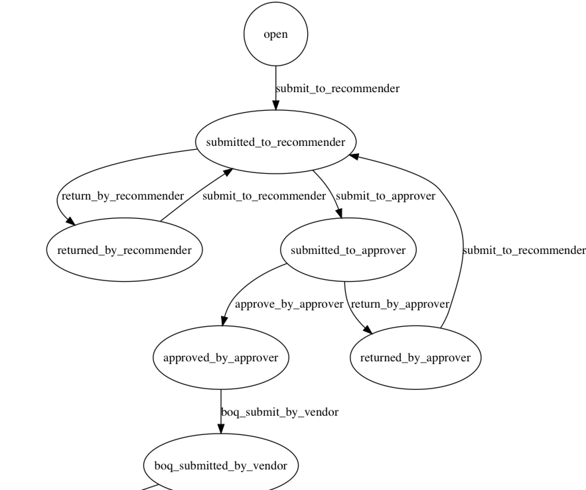

# DrawMe

This gem is used to generate state diagram for [AASM gem](https://github.com/aasm/aasm). This gem utilize Matsuda's [stateful_enum gem](https://github.com/amatsuda/stateful_enum) graph generator to generate AASM state diagram. Tested with rails 5.1.4

## Installation
Before we start with DrawMe gem there are dependencies for [AASM gem](https://github.com/aasm/aasm) such as graphiz installation and other stuff are need to be done beforehand. Please head to [AASM gem](https://github.com/aasm/aasm) page for more info about the setup.

1. Create a `doc` folder in your app root directory.

2. Add this line to your application's Gemfile:

```ruby
gem 'aasm'
gem 'stateful_enum'
gem 'draw_me'
```

3. And then execute:

    $ bundle


## Usage

1. include it into your `model` or directly into your `ApplicationRecord` file.
```
class EmergencyPurchase < ApplicationRecord
  include AASM
  include DrawMe
end
```

2. Use it in your console
```
$ rails c
2.4.0 :001 > to_draw = EmergencyPurchase.last
2.4.0 :001 > to_draw.draw_me
emergencypurchase_graph
=> 1
```

if you want to draw all diagram for all of your models :

    2.4.0 :001 > ApplicationRecord.draw_all

You should be able to find your graph in the doc folder in your root directory.




## Contributing

Bug reports and pull requests are welcome on GitHub at https://github.com/abigoroth/draw_me. This project is intended to be a safe, welcoming space for collaboration, and contributors are expected to adhere to the [Contributor Covenant](http://contributor-covenant.org) code of conduct.


## License

The gem is available as open source under the terms of the [MIT License](http://opensource.org/licenses/MIT).

